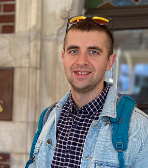

# **Khomich Vadzim**

## **Frontend Developer**
***
### **Contacts**
* **Phone:** +37525616600
* **Email:** vadim-khomich@yandex.ru
* **Linkedin**: linkedin.com/in/vadim-khomich
* **Telegram**: @vadim_khomich
* **GitHub**: https://github.com/VadzimKhomich
*** 
### **About Myself**
I graduated from Belarussian State Technological University with a degree in mechanical engineering.I have been working as a QA engineer for 2 years. I want to gain the necessary knowledge to work as a Fronted developer. I have good communication skills, I am Team player and responsible person.
*** 
### **Hard Skills**
* Git 
* Termial
* HTML, CSS, and JavaScript (basic knowledge)
* DevTools
* Jira, Jenkins, Figma
*** 
### **Code Example**
```
 function createNewArray(arr, param) {
     let newArray = []
     if(param === undefined) {
         return newArray
     } else 
         for (let i = 0; i < arr.length; i++) {
             if(arr[i].length >= param) {
                 newArray.push(arr[i])
             } else {
                 continue
             }           
     }
     return newArray
 } 
``` 
***
### **Experience**
QA engineer (2022 -  present)
*** 
### **Education**
* Belarusian State Technological University (Engineering degree)
* STQB Certified Tester
*** 
### **Languages**
* English (B1)
* Russian (Native)

